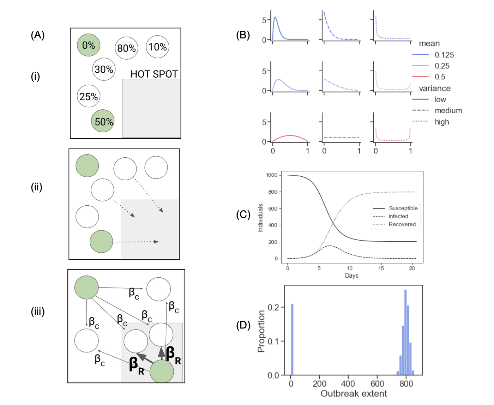
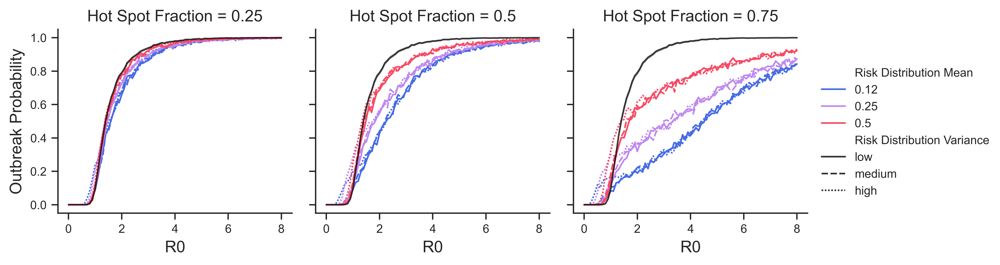
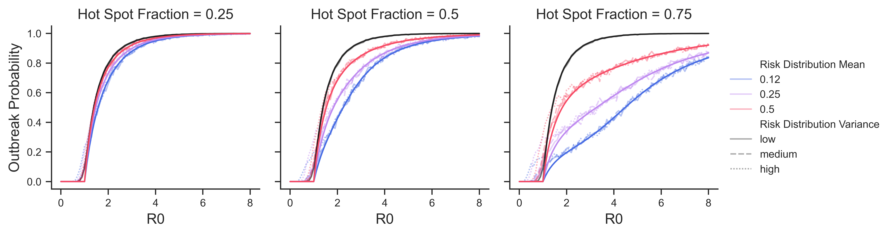
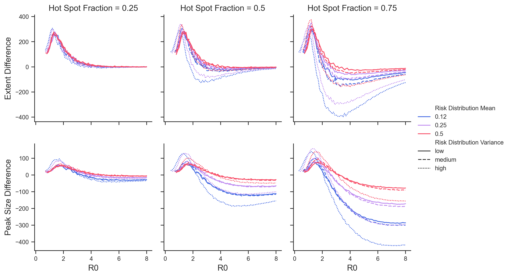
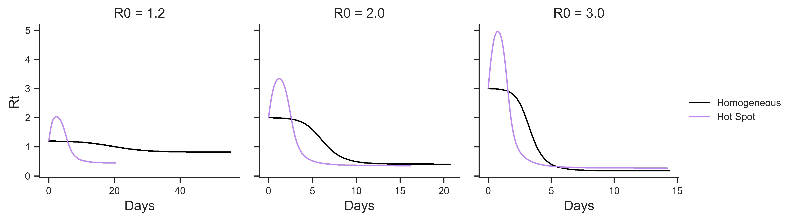
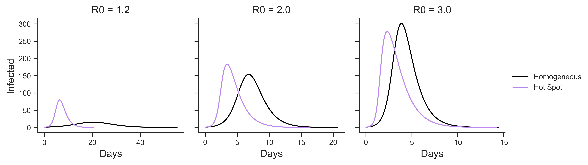
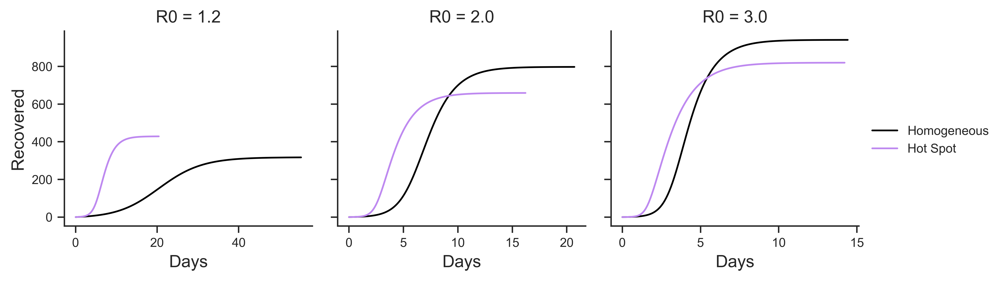

# Abstract

Superspreading is an important factor in transmission of many diseases.

Previous research either focuses on individual heterogeneity,
or incorporates very specific and realistic movement and network data.

Here we introduce a minimal stochastic model that nonetheless captures the
essential aspects of location specific and risk structured superspreading.
We explore how this mechanism shifts the
potential for large outbreaks, reshapes the epidemic curves and ultimately
changes the peak and final size of outbreaks.

We find confirmation that outbreaks of diseases with superspreading are
"infrequent but explosive" compared to those of similar but homogeneous
infectiousness.
Our predictions depart from both homogeneous models and previous models of
superspreading in that we additionally find a general acceleration of the rise
and fall of transmissibility of the disease caused by the self-accelerating
concentration of early infections among higher risk individuals.
This causes larger outbreaks in some cases, but counterintuitively smaller and less
severe outbreaks in moderately to highly infectious diseases.

# Significance Statement

Our research explores a model of disease outbreaks that incorporates
location-specific effects (disease spreads more readily in some hot spot locations) and risk structure of the population (some people visit these locations
more often). We find that such a model agrees with established understanding
of "superspreading" in its assessment of the likelihood of
large outbreaks taking place, but predicts some notable departures
related to the size and overall development of an epidemic.

# Introduction

After the SARS pandemic in 2005, researchers noted that disease transmission
was not homogeneous: some small number of infected individuals –
"super spreaders" – were responsible for a disproportionately large number of
total infections [@lloyd-smith2005]. Subsequent research noted a similar pattern in
other diseases: 15% to 20% of infected individuals caused 75% to 85% of
subsequent infections in diseases as diverse as measles, smallpox, monkeypox, HIV and others
[@galvani2005, @james2006]. The COVID-19 pandemic follows a similar pattern:
transmission is dominated by superspreading events (SSEs) in which a 
superspreading individual infects many people over a short time
[@althouse2020, @lewis2021, @wong2020].

Many models of disease with superspreading assume individuals are more
biologically infectious or have a greater number of random contacts.
They find that, compared to disease with no heterogeneity in spread, outbreaks
with superspreading are less likely to occur but more explosive in their
early stages. The models assume some people are potential superspreaders because
of their individual characteristics - their larger lung capacity allows them to
exhale more of an airborne virus, they have more sexual partners, etc. - and
if one of these people is among the first to be infected they will infect
many more people and the disease will spread rapidly. But conversely, if the
first handful of cases in a community fails to infect a potential superspreader
the disease will peter out.

These models capture important characteristics of disease with
skewed spread, and allow for precise understanding of how heterogeneity affects
outbreaks. These models, however, assume a certain homogeneity and lack of structure
in that potential super spreaders are themselves no more likely to become infected.
Consider the spread of a sexually transmitted disease. Behavior around sexual
partners and use of prophylaxis will make some individuals more likely to spread
the disease and symetrically more likely to become infected.[^1]
COVID and other airborne diseases are known to spread most readily in certain locations,
making them heavily influenced by mobility and behavioral affects related to
these locations.[needs citations] Some people undoubtedly spend more or
less time in these locations, we wonder how the connection between probability to
be infected and probability to spread to many people could influence our understanding
of diseases with superspreading. 

[^1]: This has been studied previously in [Mark Kot & Dobromir Dimitrov paper]

More recent efforts have of course considered movement and other more realistic
nuances to try to understand superspreading.
Grossmann et al run simulation experiments
on realistic network models to find that network structure can have significant
impacts on key aspects of epidemics [@grossmann2021]. Chang et al use finely grained
mobility data to model outbreaks and predict that a small minority of locations
(points of interest) are responsible for a majority of infections [@chang2020]. 

We feel there is an opportunity to bridge the gap between earlier simple models and 
these modern more realistic models with one that captures heterogeneous structural
effects while remaining general enough to be analytically
tractable.

To this end, we introduce an agent-based model with a simple
mechanism of risk structure and location-based affects. Each agent in the model
has an unchanging riskiness level that determines the frequency
with which they visit a "hot spot" location, a location that could stand in for a
church, bar or restaurant where disease spreads more readily.
We use this model to investigate how diseases with high location-based superspreading
vary from more homogeneous diseases in terms of the likelihood of an outbreak,
and the peak and final size of outbreak when present. We show how some particular distributions of
risk taking behavior across the population heighten these effects. Finally, we
introduce analytic results that provide theoretical bases for all of these
findings and allow for robust interpretation and prediction.

   
## Agent Based hsSIR Model

The hot spot SIR (hsSIR) model begins with N individuals in a fixed population
that can be one of susceptible (S), infected (I) or recovered (R) (Fig 1).
Each day, each
infected agent $i$ may transmit an infection to any susceptible agent with fixed
probability $\beta_C$ (homogeneous community spread – Fig 1Aiii). At the same
time, each agent independently visits the "hot spot" with probability $\rho_i$;
then disease spreads from each infected individual in the hot spot to each
susceptible individual there with probability $\beta_R$ (hot spot spread –
Fig 1Aiii). $\rho_i$ is fixed for each individual but varies between individuals,
we consider different distributions of risk across the population and different
levels of $\beta_R$ and $\beta_C$ (Fig 1B).

Individuals recover from infection after a fixed number of days $D$. We start
each simulation by choosing one individual at random to be infected, and
continue until all agents are either susceptible or recovered.

## Computed quantities executive summary

Some quantities prove useful, in particular the basic and effective transmission
numbers $R_0$ and $R_e$. These are the expected
number of secondary infections per infection at the beginning of an outbreak 
and at any time during an outbreak, respectively. We find these values
to depend on the mean riskiness values of the entire, susceptible and infected
populations; as well the variance of the same.

---------------------------------------------------------------------
quantity                description
----------------        ----------------------------
model parameters

   $\beta_r$            hot spot spread

   $\beta_c$            homogeneous community spread

   $D$                  recovery time (days)

   $N$                  total number of individuals

   ${ \rho_i }$         riskiness values for each individual - $\rho_i$ is the probability
                        that individual $i$ visits the "hot spot" in a given day

dynamic variables       

   S, I, R              set of individuals in each state of susceptible, infected
   						and recovered

computed quantities  

   $\bar \rho$,
   $\bar \rho_S$,       mean riskiness of the entire, susceptible (S)
   $\bar \rho_I$        or infected (I) population

   var($\rho$),         variance of the riskiness values of the entire, susceptible (S)
   var($\rho_I$),       or infected (I) population
   var($\rho_S$)

   $R_0$                basic reproduction number

   $R_e$                effective transmission number

   

----------------------------------------------------------------------

# Results

## Large Outbreaks Less Likely with Hot Spot Spread

If one person in a small population or community becomes infected, they have a
chance of recovering before spreading the disease to anyone else; or of spreading
to only a small number who themselves recover before the initial infection
becomes an outbreak. On the other hand, as soon as more than a very small
number of secondary infections happen, a larger outbreak is all but guaranteed.
This probability of a large outbreak as a result of one initial
infection is a well known function of the population size and infectiousness of
a disease and can be quantified accurately as the probability of disease extinction
of a branching process model (See [any epidemiology textbook], or
[supplementary explanation/reader of this]).
Existing understanding of superspreading events suggests that increased
heterogeneity in disease spread decreases the probability of a large
outbreak[@galvani2005][@james2006].

Our hot spot model results show the same decrease in outbreak probability
compared to the homogeneous case (Figure 2). 
As we increase the relative contribution of hot spot to homogeneous spread in
our model, we find lower probability of a large outbreak. Comparing scenarios
with the same $R_0$ and proportion of hot spot spread, we
find that populations with a lower mean riskiness saw smaller probabilities of
disease outbreak (Figure 2 - lines of different color diverge) –
in these scenarios risk is more heavily concentrated in a smaller portion of the
population so the scenario is more heterogeneous.
Surprisingly, we found that the _variance_ of the distribution of riskiness
across the population plays no role (Figure 2 - lines of different
texture are indistinguishable).

## Branching Process Approximation Matches ABM Findings

To better understand predicted outbreak probabilities, we follow
[any epidemiology textbook], [@galvani2005] and [@james2006] and
compare the results of the hot spot model to a branching process approximation
in which we compute the probability of disease extinction. In the SI, 
we show that the extinction probability $\tau$ can be expressed as:

$$\tau = \bar\rho [(1 - \bar\rho \beta_r)(1 - \beta_c) + 
				(1 - (1 - \bar\rho \beta_r)(1 - \beta_c) \tau ]^N + 
   (1 - \bar\rho)[(1 - \beta_c) + \beta_c \tau ]^N$$

We can solve this expression implicitly for $\tau$ to yield predictions
which almost perfectly match the results from the hsSIR agent-based model
(Fig 2).

What can we learn from the agreement between the branching process model
and the agent-based model?
The branching process model ignores two factors present in the ABM:
i) the early accelerative effect in an outbreak as infected agents with
higher riskiness are infected
first, and ii) the differences in risk distribution shapes beyond their mean.
This agreement suggests that
these two factors only become significant later on into an outbreak, at which
point disease extinction has already become vanishingly unlikely.

## Outbreak Sizes Increased for Small $R_0$; Decreased for Large $R_0$

Next we look at when an outbreak does occur and ask how hot spot dynamics
affect the size and severity of the outbreak. We consider peak size – the
largest number of infected individuals at one time – and final size – the total
number of individuals infected over the entire course of the outbreak.
For very low $R_0$ (below 1.5), we see much larger outbreaks compared to the base 
homogeneous model (Fig. 3). Of course in the base model, an outbreak can't happen
at all with an $R_0$ below 1.0 (on average each individual infects 1 person) – but 
here an outbreak within only the highest risk individuals can still happen.
For moderate $R_0$ (between 1.5 and between 2.0-3.0), outbreaks with hot spot
dynamics have a higher number of infections at their peak (larger peak size), 
but infect fewer individuals over their course (smaller final size) (Fig 3).
And for high $R_0$ (above 2.0 to 3.0), outbreaks have both smaller peak and
final size.
These findings are consistently more pronounced for the risk distributions with 
(a) higher variance, and (b) lower mean riskiness (i.e. in which more alpha_r 
is higher so that more of the risk taking is concentrated in a smaller part of 
the population).

## Outbreak Dynamics Driven by Rise and Fall of Effective Transmission Rate

During an outbreak, the effective reproduction rate $R_e$ gives the
expected number of new cases generated by an infected individual before they recover.
In the homogeneous case,

$$R_e  = D \beta S$$

On average an infected individual infects $\beta$ proportion of the susceptible
population $S$ every day, and they are infected for $D$ days. So $R_e$ declines
monotonically as the number of susceptible individuals decreases, the outbreak
peaks when $R_e$ falls below 1 and cases begin to decline.

In the hotspot SIR model we find an analogous expression for $R_e$:

$$R_e = D \beta_C S + D \bar\rho_S \bar\rho_I \beta_R S
= D (\beta_c + \bar\rho_S \bar\rho_I \beta_r) S $$

This is almost the same as the homogeneus, except the simple parameter $\beta$
is replaced by the more complex $\beta_c + \bar \rho_S \bar \rho_I \beta_r$, which 
depends on the mean riskiness of the susceptible and infected populations
$\bar\rho_S$ and $\bar\rho_I$. This dependency drives the dynamical
differences beween hsSIR and (homogenous) standard SIR.

Individuals who visit the hot spot are more likely to become
infected early, pushing up the mean riskiness of the infected population
$\bar\rho_I$ and making higher risk individuals even
more likely to become infected. 
As these higher risk individuals leave the
susceptible population by becoming infected $\bar\rho_I$ declines. At
first the susceptible population is large and the infected population is
small, so this increases $\bar\rho_I$ more than it decreases $\bar\rho_S$ and
creates a positive feedback loop in which $R_e$ increases rapidly.
Eventually the susceptible population decreases in size, some number of high
risk individuals recover out of the infected population, and $\bar\rho_I$ itself
starts to decline; at this point $R_e$ begins to decrease rapidly. As we saw in
the previous section, this accelerates the
rise and decline of the outbreak, exacerbating diseases with low $R_0$ while
causing diseases with high $R_0$ to peak earlier and lower (Fig 3).

## Integrodifferential Equation Model Reveals Effect of Risk Distribution's Variance

As we increase N (while decreasing $\beta_r$ and $\beta_i$ to hold $R_0$ constant),
the ABM tends towards a more deterministic system. In the limiting case, the
behavior of the system is described perfectly by a system of integrodifferential
equations.

Given that $\beta_{hs} = \beta_c + \bar \rho_S \bar \rho_I \beta_r$, we would
like to understand how $\bar\rho_I$ and $\bar\rho_S$ change over time.
In the supplement, we introduce and develop the integrodifferential equations
to find:

1.
$$
\frac{d}{dt}\bar\rho_S = -\beta_r  I \bar\rho_I \text{Var}(\rho_s)
$$

2.
$$
\begin{aligned}
&= \bar S \left[
   \beta_c (\bar\rho_S - \bar\rho_I)
   + \beta_r \bar\rho_S \bar\rho_I((\bar\rho_S + \frac{\text{Var}(\rho_S)}{\bar\rho_S})
      - \bar\rho_I))
\right]
\end{aligned}
$$

In other words:

1. The mean riskiness of the susceptible population ($\bar \rho_S$) decreases at
a rate proportional to force of infectious spread in the hot spot ($\beta_R$),
the total infected population size ($I$) and the variance of the distribution
of riskiness in the susceptible population ($\text{var}(\rho_S)$).

2. The mean riskiness of the infected population ($\bar \rho_I$) evolves
towards a value between $\bar \rho_S$ and
$\bar \rho_S (1 + \text{Var}(\rho_S)/ (\bar \rho_S)^2)$

To reiterate, we're interested in how $R_e$ changes. The key to understanding
that is finding how $\bar\rho_I$ and $\bar\rho_S$ change, and here we've found
a remarkably simple expressions for $\bar\rho_I$'s and $\bar\rho_S$'s featuring
$\text{var}(\rho_s)$. What this all means is that in higher variance risk
distributions – i.e. in scenarios where a small
number of people visit a hot spot frequently – $\bar \rho_S$ decreases and $\bar \rho_I$
initially increases faster, heightening the accelerative outbreak dynamics that
eventually lead to different outcomes than the homogeneous case.

# Discussion

## 1. Summary of findings

The model we develop, in agreement with general findings of diseases driven by
heterogeneity and/or superspreading, finds that outbreaks are relatively less frequent
or likely to occur. Most infections lead to no or few further infections, but 
the infection of a potential superspreader leads to an explosion in early cases.
This is where our findings start to differ from the traditional superspreader story.
Under less structured assumptions, as case numbers grow the heterogeneity between
individuals' infectiousness matters less; as only the average infectiousness is
relevant. The differences in effect are averaged out, and the standard homogeneous SIR model is
a fine predictor of peak and final epidemic size.

In our model, early case numbers rise at the same time as the outbreak
becomes increasingly concentrated among high risk individuals leading to
pronounced acceleration. Then the acceleration reverses; and case numbers decline
faster than would be otherwise predicted because high risk individuals have
already preferentially been removed from the uninfected population. We show 
in the Results section how this acceleration-then-deceleration can
lead to higher _or_ lower peak and final numbers of infections.
 

## 2. Applied lessons - cite intervention timing & gravity/movement models

What implications does this have? Assuming hot spot effects are in play:

### 2.1 Intervetion timing and approaches.

People considering interventions should take away a few lessons.

The timing of interventions should consider which risk segment of the population
is being targetted. Interventions targetted at high risk individuals,
such as closing or limiting capacity in bars, restaurants or churches, may
be significantyl less useful by the time cases are high – their intended targets are more likely
to have already been previously infected.

Conversely, such interventions targetted at high risk individuals make the
most sense preventatively – i.e. in an area considered at risk of an outbreak
but without high numbers of documented cases.

### 2.2 Forecasting disease curves

Attempts to quantify parameters such as $R_0$ or to predict case numbers over
time and model the general
development an epidemic should consider the effect that
risk structure can play. One should expect that outbreaks of diseases with
high degree of superspreading, especially superspreading concentrated in high
risk individuals and/or moderated through location-based SSEs will grow very
fast in their early stages as if heading towards higher peaks and overall extents.
But then later on, things will tend to level off.

## 3. How this dovetails with empirical work

### 3.1 General movement models

Availability of cell phone data has made it possible to quantify in a very general way
the frequency with which people visit specific locations, and we can use these
results to think about
which risk distributions (fig 1B) are most realistic. One influential recent
result indicates that over broad ranges of time
the number of people $N_f$ visiting a location with frequency $f$ is proportional
to $\frac{1}{f^2}$; i.e. that frequency of visitation is power law distributed
with an exponent of 2.[@schlapfer2021] This suggests that among distributions
considered in fig 1B, those with the highest variance (dotted lines) are
the most realistic.

### 3.2 Significance of location-based effects

[References needed] suggest that airborne diseases like COVID-19 and SARS have
extremely strong location effects; with infection likelihood per unit time
increasing several orders of magnitude between indoor and outdoor exposure.

These two results are to say that we would expect hot spot dynamics to be
very relevent in such diseases.

## 4. Limitations & future work

### Assumptions

Our model makes a number of assumptions. We limit our focus to a fixed
population in an isolated community. We allow only a single hot-spot location.
Community spread is homogeneous, and besides differing riskiness
values individuals are identical in their individual infectiousness and
susceptibility. We assume individuals' risk taking choices don't
vary with rising case numbers.

Obviously none of these assumptions are realistic, but
we view it as worthwhile to understand an idealized case that
sheds light on this specific mechanism.

### Future and related work

Avenues for future work could include looking for evidence of these
dynamics in emperical data, or allowing risk-taking behavior to vary to understand
how behavioral responses to rising case numbers quantitatively affect
a disease outbreak.

## Final conclusion paragraph

We believe that our model provides a framework for thinking
about and analyzing outbreaks of disease with high
location-specific affects in populations with quantifiable risk structures.
We've provided through a unique mechinism yet more reason to expect
that diseases with superspreading are characterized by infrequent, large
outbreaks while going further to suggest that such outbreaks rise and fall
faster than conventionally predicted. We hope our research can provide a useful
starting point for future work that focuses on the role that human movement plays
in the spread of disease.

# Methods

### Setup

We initialize a fixed-size population of $N$ agents.
Each agent $i$ ($i \in [0, N)$) is characterized by a fixed "riskiness" parameter
$\rho_i \in [0, 1]$ that never changes, and a disease state of Susceptible (S),
Infected (I) or Recovered (R). We set the following parameters:

- $\beta_c \in [0, 1], << 1$ community spread rate – the probability of disease spreading
from an I to an S individual through a single community contact,
-  $\beta_p \in [0, 1], << 1$ hot-spot spread rate - the probability of disease spreading
from an I to an S individual through contact in the problem-place; this is
typically larger than $\beta_c$.
- $D$ the recovery rate - the rate at which I individuals move to
R (the disease lasts on average $1/\gamma$ time units).

All agents $i$ are initially in S, and each agent's $\rho_i$ is drawn iid. from a specific
fixed distribution $\mathrm{P}$ over $[0, 1]$. One agent is chosen at random and moved
to I to start the simulation.

### Dynamics

#### Risk Taking

Every timestep, each agent $i$ visits the problem place with
probability $\rho_i$.

#### Disease Spread

All agents in the problem place make a contact with all other agents in the
problem place; I individuals in this subset spread the disease to S
individuals with probability $\beta_p$ (problem place spread).
Simultaneously, all agents (in and out of the problem place) make contact
with all other agents and (I) individuals spread to (S) individuals with
probability $\beta_c$ (homogeneous community spread).

#### Recovery

(I) agents recover if they've been infected for $D$ days. If there are no (I) agents, the
simulation ends.

## 2.2 Investigation Procedure

To investigate how disease dynamics and outcomes differ,
we compare simulations with different levels of "hot-spot" dynamics and
different shapes of risk distribution $\mathrm{P}$ while controlling for initial
basic reproduction number $R_0$.

### Basic Reproduction Number

The first infected agent has expected infectiousness
$E[\mathrm{P}] := \bar\rho$ and will recover
in $D$ timesteps.
Each time step, this agent goes to the problem place with probability $\bar\rho$,
encounters $\bar\rho N$ susceptible agents, and infects each of them with 
probability $\beta_p$. At the same time, the agent infects all other agents with
probability $\beta_c$ each. This leads to:

$$R_0 = D (\bar\rho^2 \beta_p N)+ D (\beta_c N)
      = \frac{(\bar\rho^2 \beta_p + \beta_c) N}{\gamma}$$

### Effective Reproduction Number

### Hot-Spot weight, Risk Distributions

<!--  -->

Using this definition we can compare scenarios where hot-spot spread
contributes $1/4$, $1/2$ or $3/4$ of the expected disease spread by
varying $\beta_c$ and $\beta_p$, for the same $R_0$.

Further, we can consider different shapes of the risk distribution $\mathrm{P}$.

In particular, we use nine different Beta distributions to consider $\mathrm{P}$s
with low, medium and high variability; and low (1/8), medium (1/4), and high (1/4)
means. These are shown in detail in \[Beta Distributions Figure\].

### Procedure

We consider these three proportions of hot-spot spread; and within each, nine
distributions of risk taking; then we run simulations for values of $R_0$
ranging from 0 to 8 and compare the outcomes of the outbreaks to those of a
similar setup with no risk taking (the homogeneous case).

## 2.3 Other Models

To aid in investigating the dynamics of the model in certain cases, we consider
and analytically analyze the following additional models.

### Branching process model

When the number of infected agents is small; we use a branching process model.

\[this is developed more in the text\]

### 2.1.3 Integrodifferential model

Conversely, when the number of infected agents is large (either N is very large
or the number of infected agents is just large relative to N), we 
consider the following integrodifferential equations:

$$
\begin{aligned}
\frac{\partial S(\rho, t)}{\partial t} &=
   -\beta_c S(\rho, t) \int_{0}^1 I(u, t) du
   -\beta_r S(\rho, t) \rho \int_{0}^1 I(u, t) u du\\
\frac{\partial I(\rho, t)}{\partial t} &=
   \beta_c S(\rho, t) \int_{0}^1 I(u, t) du
   + \beta_r S(\rho, t) \rho \int_{0}^1 I(u, t) u du - \gamma I(p, t)
\end{aligned}
$$

We analyze these equations and find several useful analytic results which help
to understand the general or expected dynamics of the system; especially when
N is large.

<!-- 
### 2.1.4 Difference model

Finally, to diagnose differences between the integrodifferential model and
the agent-based model we consider a difference equation model which
combines the deterministic behavior of the former with the discrete time steps
of the latter.

 -->

\pagebreak

__Figure 1. Hot spot model.__ (A) (i) The model starts from a standard SIR model and assigns each individual a fixed "riskiness" value between 0 and 1. (ii) Each day, individuals visit the hot spot with probability equal to their riskiness. (iii) Infected agents in the hot spot spread the disease with high transmission rate to susceptible agents in the hot spot. At the same time, all infected agents spread the disease to all susceptible agents with low transmission rate. Infected agents eventually recover and cannot be infected again, and the simulation ends when no agents are infected. (B) We consider different risk distributions for the population using beta distributions with low, medium and high mean; and low, medium and high variance. See methods for more details. (C) A single simulation starts with one infected individual in a fixed population of N individuals and tracks infected and recovered agents over time until no agents are infected. (D) We run each simulation 1,000 times with the same parameters; final outcomes (here, the total number infected over the course of the outbreak - "extent") are bimodal - they cluster tightly around values that depend heavily on the parameters, or around zero (indicating that no large outbreak occurred).

\pagebreak

__Figure 2. Outbreak Probability.__ We say that an outbreak has occurred if at least 5% of individuals were infected over the course of a simulation. In a homogeneous model, the probability of this occurring increases sharply as a function of $R_0$ (black lines). (A) Colored lines show outbreak probability across 1,000 trials in the agent-based model as a function of $R_0$ for 9 different risk distributions; different panels show varying contributions of hot spot spread to $R_0$. (B) Comparison of the theoretical outbreak probability (1 minus probability of extinction in the branching process approximation) is drawn in solid lines, to the agent-based model results from (A); showing excellent agreement.

\pagebreak

__Figure 3. Effects of risk distribution on epidemic peak and final size.__ (A) Colored
lines show average epidemic size minus the peak predicted by a homogeneous model
with the same $R_0$. (B) Colored lines show average final size minus the final
size predicted by a homogeneous model with the same $R_0$. "Peak" is the 
maximum number of infected agents at any given time during a simulation,
"final size" is the total number of agents experiencing infection during a
simulation. We limit to simulations in which an outbreak occurred (at least
5% of the population was infected).

\pagebreak

__Figure 4. Effects of the risk distribution on epidemic curves.__ Top panels show how $R_t$ in the hot spot model (purple line) rises and falls sharply, contrasted with the homogeneous model (black) in which $R_t$ declines monotonically. Middle and bottom panels show how this affects the peak and total number of infections respectively. From left to right, with hot spot dynamics: low $R_0$ diseases peak higher and affect more people; medium $R_0$ diseases peak higher but affect fewer people; and high $R_0$ diseases peak lower and affect fewer people.
Figures made with scenario of risk mean of $0.25$, "high" risk distribution
variance and $0.5$ fraction of hot spot spread (middle right panel in figure 1 B,
dotted purple in the center column in figure 2 and 3).

\pagebreak

# References
