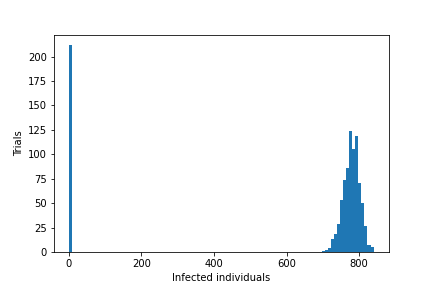

# Dynamics of "problem-place" disease spread

## Abstract

Disease transmission is not homogenous: a small number of infected individuals
are responsible for a disproportionately large number of the next generation of
infections.
This is certainly the case in COVID-19, in which 20\% of infections may cause
as many as 85\% of secondary infections[citation?].
However, our mechanistic understanding
of this phenomenon – known as superspreading – is limited[citations?].

Here we introduce and analyze
a simple model of an outbreak with superspreading via "problem-place" locations:
disease spreads homogeneously throughout the population at a low rate, but
spreads rampantly at certain locations (bars, restaurants, churches, etc.)
which individuals each visit daily with their own fixed probabilities.

Compared to homogeneous dynamics, outbreaks in this model are less
likely to happen, but are accelerated when they do occur, which causes larger
outbreaks in some cases, but paradoxically smaller and less sever outbreaks 
in highly infectious diseases ($R0 > 3.0). 

[leave in the intervention bit?]

## Introduction

Disease superspreading is well documented and even in some cases quantified.
However, our primary mechanistic understanding of it hinges on some individuals
simply being much more infectious – either by having many more connections or
simply by literally spreading a higher viral load. The latter scenario is 
not born out by the data [see paper on size of lungs, etc].
The former scenario leaves some interesting mechanics unexplored.

In any case, 

## Methods

## Superspreading

## Extinction

Given a disease with $R0$ of 2, the standard SIR model predicts an
outbreak to infect 79.681\% of the population before running its course.
When we simulate such an outbreak (homogeneous, with $R0$ of 2) in a population
of 1,000, we see outbreaks of about this size (shown in Figure 1.), 
but we also see some number of simulations in which there's no large outbreak at all.

We can predict the probability of a large vs small outbreak with reasonable
accuracy by replacing the outbreak scenario with a similarly parameterized
branching process[^1]. These predictions are shown against the simulated results
in Figure 2.

[^1]: In the homogeneous simulation, an infected individual has 
probability $p(n)$ of infecting $n$ individuals before recovering, where
$p(n)$ is nearly the probability mass function of the binomial distribution
with parameters $\beta$ (infectiousness) and $N$ (total population);
except that $N$ is not correct since not every individual is susceptible and
things are further complicated by the possibility of multiple infected
invididuals at once. In the branching process, $p(n)$ is exactly the
probability mass function of the binomial distribution with parameters $\beta$
and $N$. So to find the probability of extinction $\gamma$, we follow the normal
formula:

	$$
	\begin{aligned}
	\gamma &= p(0) + p(1) \gamma + p(2) \gamma^2 + ... + p(N) \gamma^N\\
	\gamma &= G_{Binomial(\beta, N)}(\gamma)\\
	\gamma &= (1 - \beta + \beta \gamma)^N\\
	\end{aligned}
	$$
	This can be easily computed and is how we produce the approximation in Figure 2.

How does this change in the problem place model? 

To investigate, we fix R0 and vary the contribution of "problem place" spread
to its value from zero (all community spread) to one (all problem place spread)
and observe the chance of disease extinction before an outbreak. This is shown
in Figure 3 for each of the riskyness distributions discussed in
(Figure in the Introduction).

We find that higher problem place spread means a higher chance of disease
extinction for the same level of R0, an effect that is more pronounced in riskyness
distributions with lower means, but which suprisingly does not vary between
different distributions with the same means.

To explain this effect, we again approximate with branching process.

Let X be a random variable that represents the number of infections caused by
a single infected individual with riskyness $\rho_i$ before recovering, and
let $j = 1, \ldots, N$ index the susceptible population so that $\rho_j$ is the
riskyness of individual $j$.

Then 
$$P(X = 0) = (1 - \rho_i) [ (1 - \beta_c)^N ] + \rho_i [ \prod_j (1 - (\beta_c + \beta_r \rho_j)) ]$$

By assumption riskyness for each individual is drawn independently from one
distribution, so in expectation (over riskyness values) this is:

$$
\begin{aligned}
E[P(X = 0)] &= E[(1 - \rho_i) [ (1 - \beta_c)^N ] + \rho_i [ \prod_j (1 - (\beta_c + \beta_r \rho_j)) ]]\\
&= (1 - E[\rho_i]) [ (1 - \beta_c)^N ] + E[\rho_i] [ \prod_j (1 - (\beta_c + \beta_r E[\rho_j])) ]]\\
&= (1 - \bar\rho) [ (1 - \beta_c)^N ] + \bar\rho [(1 - (\beta_c + \beta_r \bar\rho))^N ]\\
&= (1 - \bar\rho) B(\beta_c, N, 0) + \bar\rho B(\beta_c + \bar\rho \beta_r, N, 0)\\
\end{aligned}
$$

Where $B(a, b, x)$ is the Binomial probability mass at x with parameters a and b.

Similarly, $E[P(X) = x]$ is given by

$$(1 - \bar\rho) B(\beta_c, N, x) + \bar\rho B(\beta_c + \bar\rho \beta_r, N, x)$$

So

$$
\begin{aligned}
G_X(s) &= P(X=0) + P(X=1)s + P(X=2)s^2 + \ldots\\
&= [\bar\rho B_1(0) + (1 - \bar\rho)B_2(0)] + [\bar\rho B_1(1) + (1 - \bar\rho)B_2(1)]s + [\bar\rho B_1(2) + (1 - \bar\rho)B_2(2)]s^2 + \ldots\\
&= \bar\rho G_{B_1}(s) + (1 - \bar\rho)G_{B_2}(s)\\
&= \bar\rho [(1 - \bar\rho \beta_r)(1 - \beta_c) + 
				(1 - (1 - \bar\rho \beta_r)(1 - \beta_c) s]^N + 
   (1 - \bar\rho)[(1 - \beta_c) + \beta_c s]^N\\
\tau &= \bar\rho [(1 - \bar\rho \beta_r)(1 - \beta_c) + 
				(1 - (1 - \bar\rho \beta_r)(1 - \beta_c) \tau]^N + 
   (1 - \bar\rho)[(1 - \beta_c) + \beta_c \tau]^N\\
\end{aligned}
$$

For small $\beta_c + \bar\rho \beta_r$, the overlap is very small so:

$$ 
\begin{aligned}
P(X = x) &\approx (1 - \bar\rho) B(\beta_c, N, x) + \bar\rho (B(\beta_c, N, x) + B(\bar\rho \beta_r, N, x))\\
&= \bar\rho B(\bar\rho \beta_r, N, x) + B(\beta_c, N, x)\\
\end{aligned}
$$

And

$$
\begin{aligned}
G_X(s) &\approx \bar\rho [(1 - \bar\rho \beta_r) + 
				\bar\rho \beta_r s]^N + [(1 - \beta_c) + \beta_c s]^N\\
\tau &\approx \bar\rho [(1 - \bar\rho \beta_r) + 
				\bar\rho \beta_r \tau]^N + [(1 - \beta_c) + \beta_c \tau]^N
\end{aligned}
$$

Figure 4a shows how well this matches the simulation values, and Figure 4b
shows simulation vs prediction for increasing $R_0$ under different risk
distributions and ratios of $\beta_r$ and $\beta_c$.

## Max I, Final R

Next we look at only those scenarios in which an outbreak occurs and ask how
problem place dynamics affect the size and severity of the outbreak. We consider
Max I – the peak number of infected individuals – and Final R – the total number
individuals infected (and recovered) over the entire course of the outbreak.
Similar to [Extinction Probability Section] we fix a value of R_0, then for
the risk distributions discussed in [Intro Section] we vary the contribution
of problem place spread and observe the effects. This is shown in [Figure 1],
and the results thereof are summarized in [Table 1].

\pagebreak
outcome                  low R0       medium R0    high R0
---------------------   -------      ---------    --------
outbreak probability    decreased     decreased    decreased
peak infections         _increased_    _increased_    decreased
total infections        _increased_    decreased    decreased

## Disease Evolution

How can we explain these findings?

Here the differential equation model is very useful.

In a more traditional compartment model, we can find $R(t)$ – the instantaneous
expected number of secondary infections caused by a new infection at time t.

In the analysis section we show that the basic reproduction number $R(t)$ is
given by:

$$R(t) = \frac{\bar S}{\gamma} \left( \beta_c
		+ \beta_r \bar \rho_S \bar \rho_I \right)$$

where $\bar\rho_S$ and $\bar\rho_I$ are the means of riskiness in the $S$ and
$I$ populations. We also show that

\begin{equation}
\frac{d\bar\rho_S}{dt} = 
\end{equation}

and

$$\frac{d\bar\rho_I}{dt} = ...$$

so that $\bar\rho_S$ always decreases at a rate proportional to the
variance of $\rho_S$ at the time, and that $\bar\rho_I$ is forced towards
some value between $\bar\rho_S$ and $\bar\rho_S + \frac{Var(\rho_S)}{\bar\rho_S}$
– which may be much larger than $\bar\rho_S$, but must necessarily increase
initially and later decrease.

The results of this difference are shown for three different values of $R_0$,
alongside $R_t$
and $\beta_{effective}(\bar\rho_I, \bar\rho_S)$ in [Figure 1].

From here we can see what's causing [results from the previous section – Figure 2].

These results are shown for three $R_0$ scenarios in [Figure 2].

## Intervention

Finally we consider the dynamics of two interventions which interact with
the problem place dynamics: a "top down" intervention in which the problem place
is closed for some period of time, and a "bottom up" intervention in which
individuals adjust their riskyness based on the current number of infections.

## Discussion